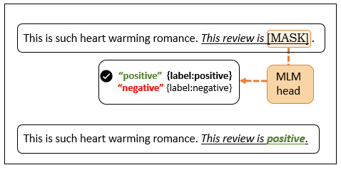

# A Comparative Analysis of Large vs Small Language Models: Are Bigger Models Always Better?

This repository hosts a compelling study delving into the capabilities and efficiencies of Language Models (LMs). 

The project is a collaborative endeavor by **David Cabestany and Clara Adsuar**.

  

## 🚩 Table of Contents 

1. [Project Synopsis](#project-synopsis)
2. [The Need for this Study](#the-need-for-this-study)
3. [Methodologies](#methodologies)
4. [Models and Tools](#models-and-tools)
5. [Learning Techniques](#learning-techniques)
6. [The Dataset](#the-dataset)
7. [Key Findings](#key-findings)
8. [What Does this Mean?](#what-does-this-mean)
9. [Getting Started](#getting-started)
10. [How to Contribute](#how-to-contribute)
11. [Peek into the Code](#peek-into-the-code)
12. [Kudos](#kudos)
13. [Reach Out](#reach-out)
14. [License](#license)

## 🧪 Project Synopsis

This study investigates the growth of Language Models (LMs) in terms of their size and popularity over the recent decades. It primarily focuses on a comparative analysis of the performance of the large-scale BERT model against the smaller DistilBERT model, both pre-trained with Masked Language Modeling and tested for sentiment classification on the same dataset.

## 💡 The Need for this Study

The race to achieve superior performances in the field of Deep Learning and NLP has cultivated a "more is better" mindset. However, potential pitfalls of large LMs like biases, harmful learning patterns, and the hefty environmental and financial costs cannot be ignored. Our project challenges this norm, and explores if smaller models like DistilBERT can match the efficiency of larger ones like BERT, while being more resource-friendly.

## 🛠️ Methodologies

- **Masked Language Modeling (MLM)**: A common pre-training method in NLP for deriving text representations.
- **Transfer Learning**: A technique that employs knowledge from one set of tasks to aid in a new, similar task.
- **Few and Zero-shot Learning**: Methods devised to enable deep learning models to generalize with minimal (or zero) example instances.

## 🧩 Models and Tools

- **BERT**: A Transformer-based model for language representation that employs unlabelled text for pre-training bidirectional representations.
- **DistilBERT**: A leaner and more efficient rendition of BERT, obtained through knowledge distillation, that displays comparable performance on numerous downstream tasks.

## 🎓 Learning Techniques

We make use of few-shot and zero-shot learning techniques in this study, as labeled datasets can be resource-intensive due to constraints like time, human effort, and financial inputs. These methods strive to develop a deep learning model that can generalize effectively with minimal (or zero) example instances.

## 📊 The Dataset

The core dataset we have used for sentiment analysis in this study is the [Amazon Product Data](https://jmcauley.ucsd.edu/data/amazon/) created by Julian McAuley. This massive dataset comprises 142 million product reviews spread across 24 categories, providing a robust base for diverse analysis.

For our project's scope, we focused on a specific category: 'Movies and TV'. Given the extensive size of the dataset, we employed the 5-core subset that contains only users and products with at least 5 reviews. The absolute count of reviews in this subset totals 1,697,533. Initially, we extracted 11.7% of this subset, approximately 200,000 reviews, for our analysis. However, after several preliminary experiments, we further streamlined this to 5% of the extracted data, settling on 10,000 reviews for the final analysis.

The data structure of the product reviews in the 'Movies and TV' category can be divided into ten sections:

1. `overall`: The product rating.
2. `verified`: Indicates whether the reviewer's account is verified.
3. `reviewTime`: The timestamp of the review's publication.
4. `reviewerID`: The ID or nickname of the reviewer.
5. `asin`: The ID of the product.
6. `style`: The format of the movie or TV-series in this subset.
7. `reviewerName`: The name of the reviewer.
8. `reviewText`: The actual review content provided by the reviewer (used for sentiment analysis).
9. `summary`: A summary of the review.
10. `unixReviewTime`: The timestamp of the review's publication, represented in Unix time.

The central focus of our sentiment analysis lies on the `reviewText` section, as it contains the reviewer's opinion about the product. During the evaluation period, we simplified the `overall` rating to be used as our label: a rating between 4 and 5 is classified as "positive", whereas a rating between 1 and 3 is considered "negative". Thus, the `overall` and `reviewText` sections are pivotal in our evaluation process.

## Sample Data

To provide an idea of the dataset structure, here is a small sample from the 'Movies and TV' category of the Amazon Product Data:

| Rating | Votes | Review Text | Summary |
| :---: | :---: | :--- | :--- |
| 4.0 | - | real sharp beautiful detail. great extras. if you enjoy classic 50's sci-fi you will enjoy owning this disc. | classic sci-fi 1950's |
| 5.0 | 2 | This classic b&w sci-fi movie in blu-ray is spectacular...anyone who doubts how much better blu-ray is compared to regular dvd media needs to see this one! | Better in Blu-Ray |
| 1.0 | 3 | This a review of the blue Ray disk....this is not about the movie per say.  It is about chapter 81 when Patricia Neal is being carried to the saucer by Gort AND THE DAMN WIRES ARE STILL VISABLE!!!!!  WHY????  WHY COULDN'T THEY GET RID OF HER WIRES?  wHAT IS THE PROBLEM?  IT RUINES THE ENTIRE MOVIE!!!! SHAME ON YOU PEOPLE FOR DOING THAT TO US!!! | WHY ARE THE WIRES STILL THERE? |
| 2.0 | - | The set up for the plot takes about an hour, and the "funny" typical Ball moments were stuck into 30 mins. | Unfortunately Bad |
| 1.0 | - | Dumb movie.  We turned it off. | Dumb movie. We turned it off |

Each row in the table represents an individual review. The `Rating` and `Review Text` columns are of significant importance in our sentiment analysis, with the `Rating` providing a simplified label for sentiment.

### 📈 Key Findings

Great news! In our study, we compared two language models, DistilBERT and BERTBase, to see how well they perform in sentiment analysis using different classification techniques.

In few-shot classification, both models showed similar performance, but BERTBase had a slight edge in some cases. It classified a few more real negative samples correctly, while DistilBERT did better with real positive samples.

However, in zero-shot classification, DistilBERT stole the spotlight! It outperformed itself in few-shot and even beat BERTBase, achieving higher precision. But, here's the catch – overall, the accuracy of both models didn't reach the level we hoped for. The best precision score we got was 0.52.

### 🌎 What Does this Mean?

Don't worry, there's some good news too! DistilBERT proved to be a champ in low-resource environments because it needs less training time due to its smaller parameter count. So, if you're dealing with smaller datasets, DistilBERT is your go-to superhero – it slightly outperforms BERTBase.

But hold on, sentiment analysis is tricky, and both models still have room for improvement. We discovered that both struggled to achieve super accurate results. So, if we really want a top-notch sentiment analysis model, we might need a larger dataset to get those satisfactory metric scores.

For future experiments, we suggest exploring the boundary where DistilBERT can shine without relying on huge datasets. This way, we can find that sweet spot for the best performance without breaking the bank on data collection.

Keep on experimenting and improving, and we'll get there! 🚀

## 👀 Peek into the Code

For a better understanding of the project's inner workings, check out these [code snippets](./Scripts).

## 👏 Kudos

We developed this project as a final assignment for the subject Deep Learning in the Master’s program HAP-LAP at the University of the Basque Country (EHU/UPV). Our supervisor for the project was Ander Barrena.

## 📞 Reach Out

- David Cabestany - dcabesma@gmail.com

We appreciate your interest in our project! For more information, please visit the project repository and feel free to reach out with any questions or comments. 

## 📜 License

This project is licensed under the MIT License - see the [LICENSE.md](https://github.com/username/repo/LICENSE.md) file for details.

---

_Last Updated: 2023-07-24_

Feel free to ⭐️ this repository if this project interests you! 😊
